<h1 style='font-size:20px;text-align: center'>
A machine learning algorithm based on Gaussian processes 
<br> for MODIS multilayer cloud and thermodynamic phase 
<br> classification using CALIOP and CloudSat
</h1>

<p style='text-align: center'>
Author: Benjamin Marchant 
<br>(marchant.benjamin01@gmail.com)
<br>(benjamin.marchant@nasa.gov)
<br> v1.0.0
</p>

This Jupyter notebook presents a machine learning algorithm based on Gaussian processes to detect cloud thermodynamic phase and multilayer clouds for the MODIS (Moderate Resolution Imaging Spectroradiometer) instrument. The algorithm is trained using a co-located dataset between MODIS CALIOP and CloudSat.

Note 1: dataset used to train the algorithm can be downloaded on Github or 

Note 2: More information about the author can be found on the following <a href="https://moonbooks.org/Notebooks/6364d3f0f495b6ab9dcf8d3b5c6e0b01/">open notebook</a>


Table of Content:

* [Read MODIS CALIOP CLoudSat Co-located Dataset](#dataset)
* [Create cloud phase & multilayer cloud labels](#labels) 
* [Data Preparation (scaling and standardization)](#data_preparation)
* [Create a learning function](#learning_function)
* [Create an evaluation function](#evaluation_function)
* [Train a model that detect monolayer liquid cloud](#monolayer_liquid)
* [Train a model that detect monolayer ice cloud](#monolayer_ice)
* [Train a model that detect monolayer mixed cloud](#monolayer_mixed)
* [Train a model that detect multilayer (ice / liquid) cloud](#multilayer_ice_liquid)
* [Train a model that detect multilayer (ice / mixed) cloud](#multilayer_ice_mixed)
* [Train a model that detect multilayer (ice / ice) cloud](#multilayer_ice_ice)
* [Train a model that detect multilayer (liquid / liquid) cloud](#multilayer_liquid_liquid)


```python
from sklearn.metrics import accuracy_score, log_loss
from sklearn.gaussian_process import GaussianProcessClassifier
from sklearn.gaussian_process.kernels import RBF
from sklearn.gaussian_process.kernels import DotProduct, ConstantKernel as C
from sklearn.model_selection import train_test_split
from sklearn import preprocessing
from sklearn.metrics import accuracy_score
from sklearn.metrics import confusion_matrix
from sklearn.utils import resample
from sklearn.metrics import roc_curve, auc
from sklearn.metrics import roc_auc_score
from sklearn.metrics import log_loss

from pyhdf.SD import SD, SDC 
from matplotlib.pyplot import figure
from random import shuffle 
from scipy.spatial.distance import pdist, cdist

import matplotlib.pyplot as plt
import matplotlib as mpl
import pandas as pd
import numpy as np
import seaborn as sns; sns.set()
import numpy.ma as ma
import pprint
import warnings

warnings.filterwarnings('ignore')
```


```python
from IPython.core.display import HTML
HTML("""
<style>
.output_png {
    display: table-cell;
    text-align: center;
    vertical-align: middle;
}
</style>
""")
```


<style>
.output_png {
    display: table-cell;
    text-align: center;
    vertical-align: middle;
}
</style>


### Read MODIS CALIOP CLoudSat Co-located Dataset <a class="anchor" id="dataset"></a>

To train the algorithm, a co-located MODIS CALIOP and CloudSat Dataset has been created using random sampling of pixels selected during the month of January 2008 (5.000 pixels selected randomly each day -> dataset size 31*5000=155000):


```python
df = pd.read_csv('2008_01_colocated_modis_caliop_cloudsat_random_sample_dataset.csv',index_col=False)

print('dataframe shape',df.shape)
```

    dataframe shape (155000, 113)


The file includes the following information:


```python
column_names_list = df.columns

for name in column_names_list:
    print(name)
```

    modis_multilayer_cloud
    modis_multilayer_cloud_qa1
    modis_multilayer_cloud_qa2
    modis_multilayer_cloud_qa3
    modis_multilayer_cloud_qa4
    modis_multilayer_cloud_qa5
    modis_cloud_phase
    latitude
    longitude
    modis_cloud_top_height_1km
    modis_cloud_effective_radius
    modis_cloud_effective_radius_16
    modis_cloud_effective_radius_37
    modis_cloud_optical_thickness
    surface_flag
    nb_tot_cloud_layers
    caliop_1km_nb_cloud_layers
    caliop_5km_nb_cloud_layers
    cldclass_lidar_nb_cloud_layers
    modis_band_1
    modis_band_2
    modis_band_3
    modis_band_4
    modis_band_5
    modis_band_6
    modis_band_7
    modis_band_8
    modis_band_9
    modis_band_10
    modis_band_11
    modis_band_12
    modis_band_13l
    modis_band_13h
    modis_band_14l
    modis_band_14h
    modis_band_15
    modis_band_16
    modis_band_17
    modis_band_18
    modis_band_19
    modis_band_26
    modis_band_20
    modis_band_21
    modis_band_22
    modis_band_23
    modis_band_24
    modis_band_25
    modis_band_27
    modis_band_28
    modis_band_29
    modis_band_30
    modis_band_31
    modis_band_32
    modis_band_33
    modis_band_34
    modis_band_35
    modis_band_36
    modis_band_1_atm_corr_refl
    modis_band_2_atm_corr_refl
    modis_band_5_atm_corr_refl
    modis_band_6_atm_corr_refl
    modis_band_7_atm_corr_refl
    modis_band_20_atm_corr_refl
    cloud_layer_top_01
    cloud_layer_base_01
    cloud_layer_optical_depth_01
    cloud_layer_phase_01
    cloud_layer_source_01
    cloud_layer_top_02
    cloud_layer_base_02
    cloud_layer_optical_depth_02
    cloud_layer_phase_02
    cloud_layer_source_02
    cloud_layer_top_03
    cloud_layer_base_03
    cloud_layer_optical_depth_03
    cloud_layer_phase_03
    cloud_layer_source_03
    cloud_layer_top_04
    cloud_layer_base_04
    cloud_layer_optical_depth_04
    cloud_layer_phase_04
    cloud_layer_source_04
    cloud_layer_top_05
    cloud_layer_base_05
    cloud_layer_optical_depth_05
    cloud_layer_phase_05
    cloud_layer_source_05
    cloud_layer_top_06
    cloud_layer_base_06
    cloud_layer_optical_depth_06
    cloud_layer_phase_06
    cloud_layer_source_06
    cloud_layer_top_07
    cloud_layer_base_07
    cloud_layer_optical_depth_07
    cloud_layer_phase_07
    cloud_layer_source_07
    cloud_layer_top_08
    cloud_layer_base_08
    cloud_layer_optical_depth_08
    cloud_layer_phase_08
    cloud_layer_source_08
    cloud_layer_top_09
    cloud_layer_base_09
    cloud_layer_optical_depth_09
    cloud_layer_phase_09
    cloud_layer_source_09
    cloud_layer_top_10
    cloud_layer_base_10
    cloud_layer_optical_depth_10
    cloud_layer_phase_10
    cloud_layer_source_10


```python
df.head(10)
```


<div>
<style scoped>
    .dataframe tbody tr th:only-of-type {
        vertical-align: middle;
    }

    .dataframe tbody tr th {
        vertical-align: top;
    }

    .dataframe thead th {
        text-align: right;
    }
</style>
<table border="1" class="dataframe">
  <thead>
    <tr style="text-align: right;">
      <th></th>
      <th>modis_multilayer_cloud</th>
      <th>modis_multilayer_cloud_qa1</th>
      <th>modis_multilayer_cloud_qa2</th>
      <th>modis_multilayer_cloud_qa3</th>
      <th>modis_multilayer_cloud_qa4</th>
      <th>modis_multilayer_cloud_qa5</th>
      <th>modis_cloud_phase</th>
      <th>latitude</th>
      <th>longitude</th>
      <th>modis_cloud_top_height_1km</th>
      <th>...</th>
      <th>cloud_layer_top_09</th>
      <th>cloud_layer_base_09</th>
      <th>cloud_layer_optical_depth_09</th>
      <th>cloud_layer_phase_09</th>
      <th>cloud_layer_source_09</th>
      <th>cloud_layer_top_10</th>
      <th>cloud_layer_base_10</th>
      <th>cloud_layer_optical_depth_10</th>
      <th>cloud_layer_phase_10</th>
      <th>cloud_layer_source_10</th>
    </tr>
  </thead>
  <tbody>
    <tr>
      <th>0</th>
      <td>5.0</td>
      <td>1.0</td>
      <td>0.0</td>
      <td>0.0</td>
      <td>0.0</td>
      <td>1.0</td>
      <td>2.0</td>
      <td>-49.767658</td>
      <td>-144.492096</td>
      <td>2700.0</td>
      <td>...</td>
      <td>0.000000</td>
      <td>0.000000</td>
      <td>-9999.0</td>
      <td>0.0</td>
      <td>0.0</td>
      <td>0.0</td>
      <td>0.0</td>
      <td>-9999.0</td>
      <td>0.0</td>
      <td>0.0</td>
    </tr>
    <tr>
      <th>1</th>
      <td>1.0</td>
      <td>0.0</td>
      <td>0.0</td>
      <td>0.0</td>
      <td>0.0</td>
      <td>0.0</td>
      <td>2.0</td>
      <td>7.892334</td>
      <td>87.800476</td>
      <td>4750.0</td>
      <td>...</td>
      <td>2.049999</td>
      <td>1.449999</td>
      <td>0.0</td>
      <td>3.0</td>
      <td>3.0</td>
      <td>0.0</td>
      <td>0.0</td>
      <td>-9999.0</td>
      <td>0.0</td>
      <td>0.0</td>
    </tr>
    <tr>
      <th>2</th>
      <td>1.0</td>
      <td>0.0</td>
      <td>0.0</td>
      <td>0.0</td>
      <td>0.0</td>
      <td>0.0</td>
      <td>2.0</td>
      <td>-52.644794</td>
      <td>29.831434</td>
      <td>500.0</td>
      <td>...</td>
      <td>0.000000</td>
      <td>0.000000</td>
      <td>-9999.0</td>
      <td>0.0</td>
      <td>0.0</td>
      <td>0.0</td>
      <td>0.0</td>
      <td>-9999.0</td>
      <td>0.0</td>
      <td>0.0</td>
    </tr>
    <tr>
      <th>3</th>
      <td>1.0</td>
      <td>0.0</td>
      <td>0.0</td>
      <td>0.0</td>
      <td>0.0</td>
      <td>0.0</td>
      <td>2.0</td>
      <td>28.681301</td>
      <td>-40.599194</td>
      <td>50.0</td>
      <td>...</td>
      <td>0.000000</td>
      <td>0.000000</td>
      <td>-9999.0</td>
      <td>0.0</td>
      <td>0.0</td>
      <td>0.0</td>
      <td>0.0</td>
      <td>-9999.0</td>
      <td>0.0</td>
      <td>0.0</td>
    </tr>
    <tr>
      <th>4</th>
      <td>1.0</td>
      <td>0.0</td>
      <td>0.0</td>
      <td>0.0</td>
      <td>0.0</td>
      <td>0.0</td>
      <td>2.0</td>
      <td>-67.958023</td>
      <td>-82.737038</td>
      <td>1250.0</td>
      <td>...</td>
      <td>0.000000</td>
      <td>0.000000</td>
      <td>-9999.0</td>
      <td>0.0</td>
      <td>0.0</td>
      <td>0.0</td>
      <td>0.0</td>
      <td>-9999.0</td>
      <td>0.0</td>
      <td>0.0</td>
    </tr>
    <tr>
      <th>5</th>
      <td>1.0</td>
      <td>0.0</td>
      <td>0.0</td>
      <td>0.0</td>
      <td>0.0</td>
      <td>0.0</td>
      <td>2.0</td>
      <td>-60.335007</td>
      <td>-138.910355</td>
      <td>850.0</td>
      <td>...</td>
      <td>0.000000</td>
      <td>0.000000</td>
      <td>-9999.0</td>
      <td>0.0</td>
      <td>0.0</td>
      <td>0.0</td>
      <td>0.0</td>
      <td>-9999.0</td>
      <td>0.0</td>
      <td>0.0</td>
    </tr>
    <tr>
      <th>6</th>
      <td>8.0</td>
      <td>0.0</td>
      <td>1.0</td>
      <td>1.0</td>
      <td>0.0</td>
      <td>1.0</td>
      <td>3.0</td>
      <td>-63.907398</td>
      <td>36.836395</td>
      <td>7450.0</td>
      <td>...</td>
      <td>0.000000</td>
      <td>0.000000</td>
      <td>-9999.0</td>
      <td>0.0</td>
      <td>0.0</td>
      <td>0.0</td>
      <td>0.0</td>
      <td>-9999.0</td>
      <td>0.0</td>
      <td>0.0</td>
    </tr>
    <tr>
      <th>7</th>
      <td>1.0</td>
      <td>0.0</td>
      <td>0.0</td>
      <td>0.0</td>
      <td>0.0</td>
      <td>0.0</td>
      <td>2.0</td>
      <td>-23.554411</td>
      <td>-4.174837</td>
      <td>0.0</td>
      <td>...</td>
      <td>0.000000</td>
      <td>0.000000</td>
      <td>-9999.0</td>
      <td>0.0</td>
      <td>0.0</td>
      <td>0.0</td>
      <td>0.0</td>
      <td>-9999.0</td>
      <td>0.0</td>
      <td>0.0</td>
    </tr>
    <tr>
      <th>8</th>
      <td>1.0</td>
      <td>0.0</td>
      <td>0.0</td>
      <td>0.0</td>
      <td>0.0</td>
      <td>0.0</td>
      <td>2.0</td>
      <td>-16.378271</td>
      <td>-30.564116</td>
      <td>2800.0</td>
      <td>...</td>
      <td>0.000000</td>
      <td>0.000000</td>
      <td>-9999.0</td>
      <td>0.0</td>
      <td>0.0</td>
      <td>0.0</td>
      <td>0.0</td>
      <td>-9999.0</td>
      <td>0.0</td>
      <td>0.0</td>
    </tr>
    <tr>
      <th>9</th>
      <td>0.0</td>
      <td>0.0</td>
      <td>0.0</td>
      <td>0.0</td>
      <td>0.0</td>
      <td>0.0</td>
      <td>4.0</td>
      <td>-6.938173</td>
      <td>115.692223</td>
      <td>7150.0</td>
      <td>...</td>
      <td>0.000000</td>
      <td>0.000000</td>
      <td>-9999.0</td>
      <td>0.0</td>
      <td>0.0</td>
      <td>0.0</td>
      <td>0.0</td>
      <td>-9999.0</td>
      <td>0.0</td>
      <td>0.0</td>
    </tr>
  </tbody>
</table>
<p>10 rows × 113 columns</p>
</div>


Remove rows with no data or clear pixels:


```python
df = df[df.modis_multilayer_cloud != 0]

print('dataframe shape',df.shape)
```

    dataframe shape (111558, 113)


```python
df['latitude'].plot(kind='hist',bins=50)

plt.xlabel('latitude')

plt.show()
```


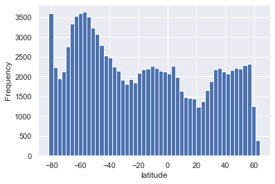


Remove pixels with latitude > 70:


```python
df = df.loc[ abs( df['latitude'] ) < 70]

print('dataframe shape',df.shape)
```

    dataframe shape (101483, 113)


Gaussian processes are a "Lazy Learning" method (meaning that the training dataset will be used to make each new predictions). So it becomes slower with incrising the training dataset size. To avoid that, let's just take a smaller sample size: 


```python
df = df.sample(n=10000, random_state = 42)
#df = df.sample(n=10000)
#df = df.head(n=10000)
```


```python
df.shape
```


    (10000, 113)


### Create cloud phase & multilayer cloud labels <a class="anchor" id="labels"></a>

Using the cldclass-lidar product (corresponding to cloud_layer_source = 3) in the dataset, let's define monolayer and multilayer clouds labels that will be used to train the machine learning algorithm:


```python
df['label 1'] = 'unlabeled'
df['label 2'] = 'unlabeled'

#print(df.head())

for index, row in df.iterrows():
    nb_cloud_layer = 0
    cloud_phase_per_layer_list = []
    for layer_idx in range(10):
        if int( row['cloud_layer_source_{:02d}'.format(layer_idx+1)] ) == 3: # cldclass-lidar product
            cloud_phase_per_layer_list.append( int( row['cloud_layer_phase_{:02d}'.format(layer_idx+1)] ) )
            nb_cloud_layer = nb_cloud_layer + 1
    if nb_cloud_layer == 1: # monolayer cloud   
        df.loc[index,'label 1'] = 'monolayer (n=1)'
        if cloud_phase_per_layer_list[0] == 1: df.loc[index,'label 2'] = 'ice'
        if cloud_phase_per_layer_list[0] == 2: df.loc[index,'label 2'] = 'mixed'    
        if cloud_phase_per_layer_list[0] == 3: df.loc[index,'label 2'] = 'liquid'
    if nb_cloud_layer == 2: # multilayer cloud 
        df.loc[index,'label 1'] = 'multilayer (n=2)'
        if cloud_phase_per_layer_list[0] == 1 and cloud_phase_per_layer_list[1] == 1: 
            df.loc[index,'label 2'] = 'ice / ice'
        if cloud_phase_per_layer_list[0] == 1 and cloud_phase_per_layer_list[1] == 3: 
            df.loc[index,'label 2'] = 'ice / liquid'
        if cloud_phase_per_layer_list[0] == 1 and cloud_phase_per_layer_list[1] == 2: 
            df.loc[index,'label 2'] = 'ice / mixed'
        if cloud_phase_per_layer_list[0] == 3 and cloud_phase_per_layer_list[1] == 3: 
            df.loc[index,'label 2'] = 'liquid / liquid'
        if cloud_phase_per_layer_list[0] == 2 and cloud_phase_per_layer_list[1] == 3: 
            df.loc[index,'label 2'] = 'mixed / liquid'    
        if cloud_phase_per_layer_list[0] == 3 and cloud_phase_per_layer_list[1] == 1: 
            df.loc[index,'label 2'] = 'liquid / ice'
    if nb_cloud_layer > 2: # multilayer cloud 
        df.loc[index,'label 1'] = 'multilayer (n>2)'
```


```python
df['label 1'].value_counts()
```


    monolayer (n=1)     5842
    multilayer (n=2)    2661
    multilayer (n>2)    1079
    unlabeled            418
    Name: label 1, dtype: int64


```python
df['label 1'].value_counts().plot(kind='pie', figsize=(8, 8))

plt.show()
```


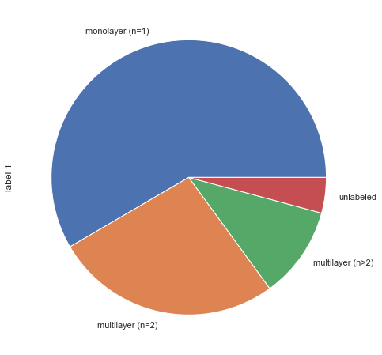


```python
df['label 1'].value_counts().plot(kind='bar')

plt.show()
```


```python
df['label 2'].value_counts()
```


    liquid             2908
    ice                1624
    unlabeled          1560
    mixed              1310
    ice / liquid       1237
    ice / mixed         479
    ice / ice           452
    liquid / liquid     271
    mixed / liquid      151
    liquid / ice          8
    Name: label 2, dtype: int64


```python
df['label 2'].value_counts().plot(kind='bar')

plt.show()
```


```python
df.drop( df[(df['label 1'] == 'unlabeled' ) | (df['label 2'] == 'unlabeled')].index, inplace=True )

print(df.shape)
```

    (8440, 115)


```python
df['label 2'].value_counts().plot(kind='bar')

plt.savefig('output.png', bbox_inches='tight')
plt.show()
```


### Data Preparation (scaling and standardization) <a class="anchor" id="data_preparation"></a>

Split the dataset between a training and testing dataset:


```python
df_train, df_test = train_test_split(df, test_size = .3, random_state = 42)

print(df_train.shape)
```

    (5908, 115)


Test data scaling with 0 mean and std = 1:


```python
df_sub_cutoff = df_train.sample(n=300, random_state=42)

features = [col for col in df if col.startswith('modis_band')] 

X_train = np.array(df_sub_cutoff[features])

scaler = preprocessing.StandardScaler().fit(X_train)

X_scaled = scaler.transform(X_train)

print(X_scaled.mean(axis=0))
print(X_scaled.std(axis=0))

print(X_scaled.shape)
```

    [-1.36187358e-16  8.88178420e-17  5.32907052e-17 -1.24344979e-16
      5.92118946e-17  3.55271368e-17 -1.18423789e-17 -7.84557604e-17
      2.96059473e-17 -5.32907052e-17 -1.77635684e-17  1.77635684e-17
     -1.77635684e-17  0.00000000e+00 -1.48029737e-17  9.84989867e-14
     -5.92118946e-18  5.92118946e-18 -5.92118946e-17  8.28966525e-17
     -5.32907052e-17  2.07241631e-17 -8.28966525e-17  8.88178420e-18
      7.99360578e-17 -1.12502600e-16 -1.53950926e-16 -8.58572472e-17
     -8.88178420e-17  1.89478063e-16  8.88178420e-17 -4.44089210e-18
     -1.33226763e-16  1.64313008e-16 -2.22044605e-17  1.43588845e-16
      2.02800739e-16 -8.88178420e-18  1.71714494e-16  7.69754630e-17
     -7.69754630e-17 -1.18423789e-17 -2.36847579e-17  0.00000000e+00]
    [1. 1. 1. 1. 1. 1. 1. 1. 1. 1. 1. 1. 1. 1. 1. 1. 1. 1. 1. 1. 1. 1. 1. 1.
     1. 1. 1. 1. 1. 1. 1. 1. 1. 1. 1. 1. 1. 1. 1. 1. 1. 1. 1. 0.]
    (300, 44)


```python
X_test_scaled = scaler.transform(df_test[features]) 

print(X_test_scaled.mean(axis=0))
print(X_test_scaled.std(axis=0))

print(X_test_scaled.shape)
```

    [-5.81856825e-02 -6.78804943e-02 -5.17735784e-02 -6.15159463e-02
     -5.89387757e-02  4.65341793e-02 -1.20713567e-02 -1.72980244e-04
      1.00707993e-01  1.62606939e-02  1.73326513e-02  7.67627094e-02
      4.67352770e-02  4.06531465e-02  6.28327948e-02  1.85762809e+02
      9.23131580e-02  3.80820084e-02 -2.02189641e-02 -4.63880326e-02
     -5.10592757e-02 -3.93622681e-02  3.18663483e-02  4.64098035e-02
      3.30134167e-02  3.29881011e-02  4.76278412e-02  3.77397670e-02
      6.85382961e-02  6.78638654e-02  4.11945284e-02  4.23541253e-02
      4.76757616e-02  4.99791226e-02  6.16795863e-02  6.63279767e-02
      7.31955291e-02 -1.50289942e-03 -4.33422773e-02 -2.92689934e-02
     -5.08739332e-02  4.43642983e-02  8.69657633e-03  0.00000000e+00]
    [9.73869571e-01 9.88688595e-01 9.70094991e-01 9.69260520e-01
     9.83009531e-01 1.00071800e+00 9.61138201e-01 9.91376546e-01
     1.03143173e+00 1.00227845e+00 9.97754229e-01 1.08376076e+00
     1.06792765e+00 1.19040860e+00 1.09619494e+00 3.56676503e+03
     1.16064187e+00 1.06145797e+00 1.00839667e+00 9.76770831e-01
     9.95893751e-01 9.09278955e-01 9.58587129e-01 9.65807044e-01
     9.59766685e-01 9.63028859e-01 9.82438542e-01 1.00328411e+00
     9.82573824e-01 9.93788984e-01 9.97704089e-01 9.93220213e-01
     9.93394861e-01 9.92236093e-01 9.80817104e-01 9.68363958e-01
     9.54256155e-01 1.03978606e+00 1.00432998e+00 9.95904168e-01
     1.03082515e+00 9.97083223e-01 1.01473091e+00 0.00000000e+00]
    (2532, 44)


Create a function that prepare the data:


```python
def data_preparation(df_train, df_test, max_train_sample_size, label_name):

    df_train_processed = df_train.copy()
    df_test_processed = df_test.copy()
    
    #----- data class balanced -----#    
    
    print(df_train_processed['label 2'].value_counts())
    
    df_train_processed['label 2'][ df_train_processed['label 2'] != label_name ] = '(not) ' + label_name
 
    df_train_processed['label 2'].value_counts().plot(kind='bar')

    plt.show()  

    #----- data class balanced -----#     
    
    # Separate majority and minority classes
    df_majority = df_train_processed[ df_train_processed['label 2'] != label_name ]
    df_minority = df_train_processed[ df_train_processed['label 2'] == label_name ]
    
    df_minority_len = len(df_minority)
    
    # Downsample majority class
    df_majority_downsampled = resample(df_majority, 
                                     replace=False,    # sample without replacement
                                     n_samples=df_minority_len,     # to match minority class
                                     random_state=123) # reproducible results

    # Combine minority class with downsampled majority class
    df_train_processed = pd.concat([df_majority_downsampled, df_minority])
    
    #print(df_train_processed)
    
    print(df_train_processed['label 2'].value_counts())

    df_train_processed['label 2'].value_counts().plot(kind='bar')

    plt.show() 
    
    #----- data train scaling -----#
    
    features = [col for col in df if col.startswith('modis_band')] 
    
    #print(df_train_processed[features])
    
    X_train = df_train_processed[features]

    scaler = preprocessing.StandardScaler().fit(X_train)

    X_train_scaled = scaler.transform(X_train)
    
    #print(X_train_scaled.mean(axis=0))
    #print(X_train_scaled.std(axis=0))

    #print(X_train_scaled.shape)    

    df_train_processed[features] = X_train_scaled
    
    #print(df_train_processed[features])
    
    #----- data test scaling -----#    
    
    X_test_scaled = scaler.transform(df_test_processed[features])
    
    df_test_processed[features] = X_test_scaled
    
    df_test_processed['label 2'][ df_test_processed['label 2'] != label_name ] = '(not) ' + label_name
    
    #----- data sub sampling -----#
    
    if df_minority_len * 2.0 > max_train_sample_size:

        df_majority = df_train_processed[ df_train_processed['label 2'] != label_name ]
        df_minority = df_train_processed[ df_train_processed['label 2'] == label_name ]    

        df_majority = df_majority.sample(n=int(max_train_sample_size/2.0), random_state=42)
        df_minority = df_minority.sample(n=int(max_train_sample_size/2.0), random_state=42)

        df_train_processed = pd.concat([df_majority, df_minority])

        df_train_processed['label 2'].value_counts().plot(kind='bar')

        plt.show()     

    return scaler, df_train_processed, df_test_processed
```

### Create a learning function<a class="anchor" id="learning_function"></a>


```python
def train_gp_model(label_name, features_train, df_train_processed):

    df_train_column_names_list = list(df.columns)

    features_train_idx = [df_train_column_names_list.index(i) for i in features_train] 
    
    kernel = C(1.0, (0.1, 10.0)) * RBF([0.2,0.2,0.2,0.2,0.2,0.2,0.2,0.2], (1e-2, 1e2))

    gp = GaussianProcessClassifier(kernel=kernel, n_restarts_optimizer=20)

    gp.fit(df_train_processed.iloc[:,features_train_idx], df_train_processed['label 2'])
    
    return gp
```

### Create an evaluation function <a class="anchor" id="evaluation_function"></a>


```python
def evaluate_gp_model(label_name, features_train, gp, df_test_processed):
    
    df_train_column_names_list = list(df.columns)

    features_train_idx = [df_train_column_names_list.index(i) for i in features_train]  
    
    y_true = df_test_processed['label 2']
    y_pred = gp.predict_proba(df_test_processed.iloc[:,features_train_idx])
    
    df_test_processed['label 2'].value_counts().plot(kind='bar')

    plt.show() 

    y_pred_list = []
    y_liq_liq_list = []
    y_liq_notliq_list = []
    y_notliq_liq_list = []
    y_notliq_notliq_list = []
    for i in range(y_pred.shape[0]):
        #print(y_pred[i,0],y_pred[i,1],y_true.iloc[i])
        if y_pred[i,0] >= 0.5:
            y_pred_list.append('(not) ' + label_name)
        else:
            y_pred_list.append(label_name)
        if y_true.iloc[i] == label_name:
            y_liq_liq_list.append(y_pred[i,1])
            y_liq_notliq_list.append(y_pred[i,0])  
        else:
            y_notliq_liq_list.append(y_pred[i,1])
            y_notliq_notliq_list.append(y_pred[i,0])                       
    
    print('accuracy_score:',accuracy_score(y_true, y_pred_list))  
    
    cm_data = confusion_matrix(y_true, y_pred_list) 

    #print(cm_data)
    
    label_list = ['(not) ' + label_name, label_name]
    label_list.sort()

    #df_cm = pd.DataFrame(100.0*cm_data/np.sum(cm_data), index = label_list, columns = label_list)

    #sns.heatmap(df_cm, annot=True)

    #plt.show()
    #plt.close()    
    
    plt.hist(y_liq_liq_list, alpha = 0.5, label=label_name)
    
    plt.hist(y_liq_notliq_list, alpha = 0.5, label='(not) ' + label_name)
    
    plt.title(label_name + ' -- True Label')
    
    plt.xlabel('Predicted Probability')
    plt.legend()
    
    plt.show()   
    
    plt.hist(y_notliq_liq_list, alpha = 0.5, label=label_name)
    
    plt.hist(y_notliq_notliq_list, alpha = 0.5, label='(not) ' + label_name)
    
    plt.title('(not) ' + label_name + ' -- True Label')
    
    plt.xlabel('Predicted Probability')
    
    plt.legend()
    
    plt.show()   
        
    fpr, tpr, _ = roc_curve(y_true, y_pred[:,1], pos_label=label_name)
    
    roc_auc = auc(fpr, tpr)
    plt.title('roc_auc = %0.2f' % roc_auc)
    
    lw = 2
    plt.plot(fpr, tpr, color='darkorange', lw=lw, label='ROC curve (area = %0.2f)' % roc_auc)
    
    plt.show()

    #print('log_loss', log_loss(y_true, y_pred))

    return None
```

### Train a model that detect monolayer liquid cloud <a class="anchor" id="monolayer_liquid"></a>


```python
%%time

scaler_liquid, df_train_liquid_processed, df_test_liquid_processed = data_preparation(
                                            df_train, 
                                            df_test, 
                                            max_train_sample_size = 500, 
                                            label_name = 'liquid')
```

    liquid             2064
    ice                1124
    mixed               900
    ice / liquid        855
    ice / mixed         333
    ice / ice           331
    liquid / liquid     193
    mixed / liquid      103
    liquid / ice          5
    Name: label 2, dtype: int64


    (not) liquid    2064
    liquid          2064
    Name: label 2, dtype: int64


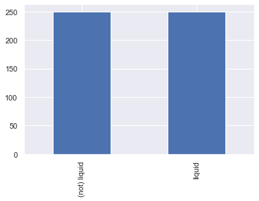


    CPU times: user 401 ms, sys: 30.5 ms, total: 432 ms
    Wall time: 433 ms


```python
%%time

features_train = ['modis_band_1','modis_band_7','modis_band_20',
                  'modis_band_26','modis_band_28','modis_band_29',
                  'modis_band_31','modis_band_32']

gp_liquid = train_gp_model('liquid', features_train, df_train_liquid_processed)
```

    CPU times: user 1min 51s, sys: 8.93 s, total: 2min
    Wall time: 1min 4s


```python
%%time

evaluate_gp_model('liquid', features_train, gp_liquid, df_test_liquid_processed)
```


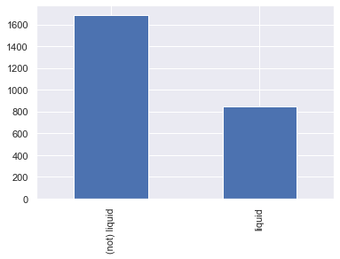


    accuracy_score: 0.782780410742496


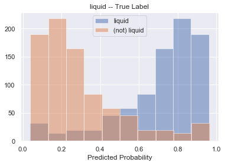


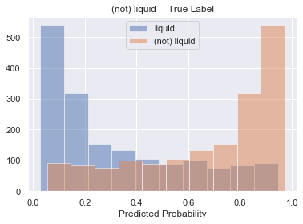


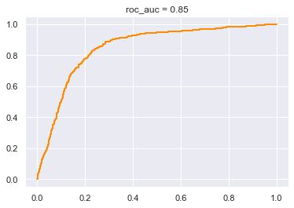


    CPU times: user 1.13 s, sys: 27.9 ms, total: 1.16 s
    Wall time: 965 ms


### Train a model that detect monolayer ice cloud <a class="anchor" id="monolayer_ice"></a>


```python
scaler_ice, df_train_ice_processed, df_test_ice_processed = data_preparation(
                                        df_train, 
                                        df_test, 
                                        max_train_sample_size = 500, 
                                        label_name = 'ice')
```

    liquid             2064
    ice                1124
    mixed               900
    ice / liquid        855
    ice / mixed         333
    ice / ice           331
    liquid / liquid     193
    mixed / liquid      103
    liquid / ice          5
    Name: label 2, dtype: int64


    (not) ice    1124
    ice          1124
    Name: label 2, dtype: int64


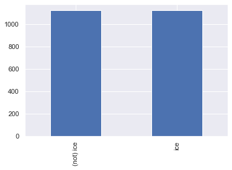


```python
gp_ice = train_gp_model('ice', features_train, df_train_ice_processed)
```


```python
evaluate_gp_model('ice', features_train, gp_ice, df_test_ice_processed)
```


    accuracy_score: 0.7863349131121643


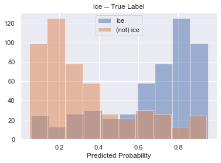


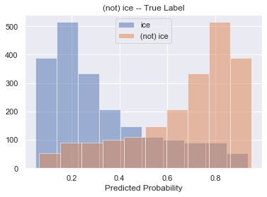


### Train a model that detect monolayer mixed cloud <a class="anchor" id="monolayer_mixed"></a>


```python
scaler_mixed, df_train_mixed_processed, df_test_mixed_processed = data_preparation(
                                        df_train, 
                                        df_test, 
                                        max_train_sample_size = 500, 
                                        label_name = 'mixed')
```

    liquid             2064
    ice                1124
    mixed               900
    ice / liquid        855
    ice / mixed         333
    ice / ice           331
    liquid / liquid     193
    mixed / liquid      103
    liquid / ice          5
    Name: label 2, dtype: int64


    mixed          900
    (not) mixed    900
    Name: label 2, dtype: int64


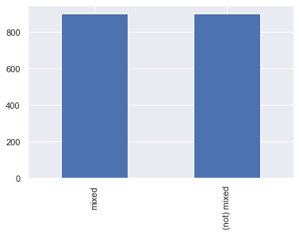


```python
%%time

features_train = ['modis_band_1','modis_band_7','modis_band_20',
                  'modis_band_26','modis_band_28','modis_band_29',
                  'modis_band_31','modis_band_32']

gp_mixed = train_gp_model('mixed', features_train, df_train_mixed_processed)
```

    CPU times: user 2min 28s, sys: 11.3 s, total: 2min 39s
    Wall time: 1min 23s


```python
evaluate_gp_model('mixed', features_train, gp_mixed, df_test_mixed_processed)
```


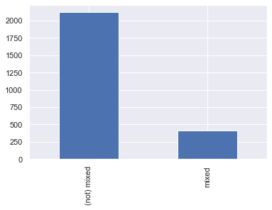


    accuracy_score: 0.7338072669826224


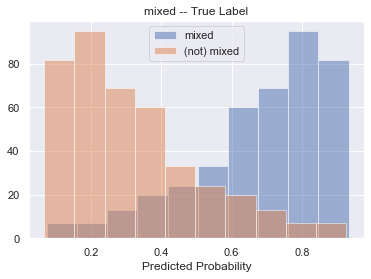


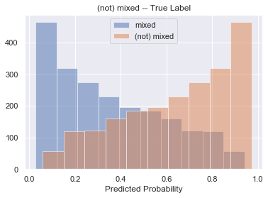


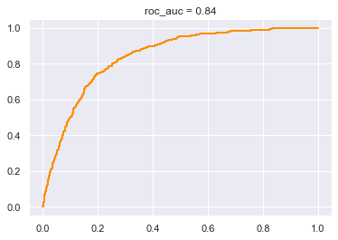


### Train a model that detect multilayer (ice / liquid) cloud <a class="anchor" id="multilayer_ice_liquid"></a>


```python
scaler_ice_over_liquid, df_train_ice_over_liquid_processed, df_test_ice_over_liquid_processed = data_preparation(
                                        df_train, 
                                        df_test, 
                                        max_train_sample_size = 500, 
                                        label_name = 'ice / liquid')
```

    liquid             2064
    ice                1124
    mixed               900
    ice / liquid        855
    ice / mixed         333
    ice / ice           331
    liquid / liquid     193
    mixed / liquid      103
    liquid / ice          5
    Name: label 2, dtype: int64


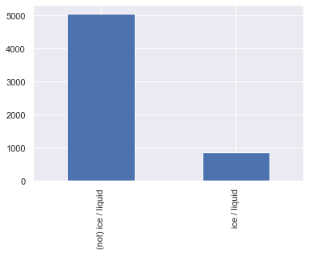


    ice / liquid          855
    (not) ice / liquid    855
    Name: label 2, dtype: int64


```python
%%time

features_train = ['modis_band_1','modis_band_7','modis_band_20',
                  'modis_band_26','modis_band_28','modis_band_29',
                  'modis_band_31','modis_band_32']

gp_ice_over_liquid = train_gp_model('ice / liquid', features_train, df_train_ice_over_liquid_processed)
```

    CPU times: user 2min 20s, sys: 10.8 s, total: 2min 31s
    Wall time: 1min 20s


```python
evaluate_gp_model('ice / liquid', features_train, gp_ice_over_liquid, df_test_ice_over_liquid_processed)
```


    accuracy_score: 0.6184834123222749


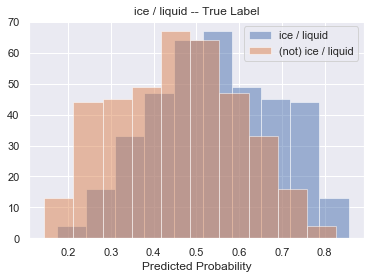


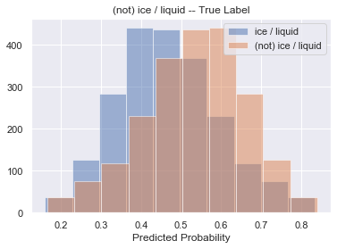


### Train a model that detect multilayer (ice / mixed) cloud <a class="anchor" id="multilayer_ice_mixed"></a>


```python
scaler_ice_over_mixed, df_train_ice_over_mixed_processed, df_test_ice_over_mixed_processed = data_preparation(
                                        df_train, 
                                        df_test, 
                                        max_train_sample_size = 500, 
                                        label_name = 'ice / mixed')
```

    liquid             2064
    ice                1124
    mixed               900
    ice / liquid        855
    ice / mixed         333
    ice / ice           331
    liquid / liquid     193
    mixed / liquid      103
    liquid / ice          5
    Name: label 2, dtype: int64


    ice / mixed          333
    (not) ice / mixed    333
    Name: label 2, dtype: int64


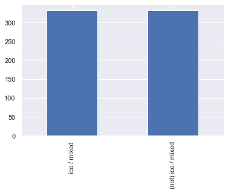


```python
%%time

features_train = ['modis_band_1','modis_band_7','modis_band_20',
                  'modis_band_26','modis_band_28','modis_band_29',
                  'modis_band_31','modis_band_32']

gp_ice_over_mixed = train_gp_model('ice / mixed', features_train, df_train_ice_over_mixed_processed)
```

    CPU times: user 2min 31s, sys: 12.8 s, total: 2min 44s
    Wall time: 1min 28s


```python
evaluate_gp_model('ice / mixed', features_train, gp_ice_over_mixed, df_test_ice_over_mixed_processed)
```


    accuracy_score: 0.6358609794628752


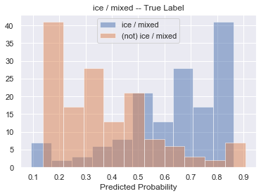


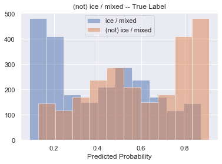


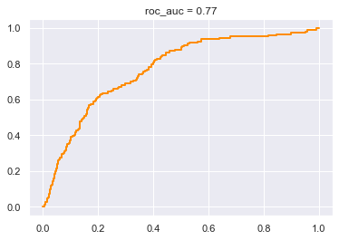


### Train a model that detect multilayer (ice / ice) cloud <a class="anchor" id="multilayer_ice_ice"></a>


```python
scaler_ice_over_ice, df_train_ice_over_ice_processed, df_test_ice_over_ice_processed = data_preparation(
                                        df_train, 
                                        df_test, 
                                        max_train_sample_size = 500, 
                                        label_name = 'ice / ice')
```

    liquid             2064
    ice                1124
    mixed               900
    ice / liquid        855
    ice / mixed         333
    ice / ice           331
    liquid / liquid     193
    mixed / liquid      103
    liquid / ice          5
    Name: label 2, dtype: int64


    (not) ice / ice    331
    ice / ice          331
    Name: label 2, dtype: int64


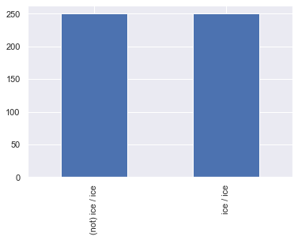


```python
%%time

features_train = ['modis_band_1','modis_band_7','modis_band_20',
                  'modis_band_26','modis_band_28','modis_band_29',
                  'modis_band_31','modis_band_32']

gp_ice_over_ice = train_gp_model('ice / ice', features_train, df_train_ice_over_ice_processed)
```

    CPU times: user 2min 11s, sys: 10.8 s, total: 2min 22s
    Wall time: 1min 15s


```python
evaluate_gp_model('ice / ice', features_train, gp_ice_over_ice, df_test_ice_over_ice_processed)
```


    accuracy_score: 0.6453396524486572


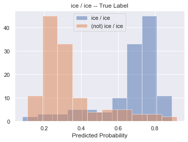


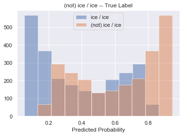


### Train a model that detect multilayer (liquid / liquid) cloud <a class="anchor" id="multilayer_liquid_liquid"></a>


```python
scaler_liquid_over_liquid, df_train_liq_over_liq_processed, df_test_liq_over_liq_processed = data_preparation(
                                        df_train, 
                                        df_test, 
                                        max_train_sample_size = 500, 
                                        label_name = 'liquid / liquid')
```

    liquid             2064
    ice                1124
    mixed               900
    ice / liquid        855
    ice / mixed         333
    ice / ice           331
    liquid / liquid     193
    mixed / liquid      103
    liquid / ice          5
    Name: label 2, dtype: int64


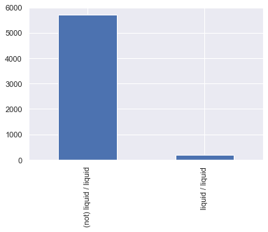


    (not) liquid / liquid    193
    liquid / liquid          193
    Name: label 2, dtype: int64


```python
%%time

features_train = ['modis_band_1','modis_band_7','modis_band_20',
                  'modis_band_26','modis_band_28','modis_band_29',
                  'modis_band_31','modis_band_32']

gp_liq_over_liq = train_gp_model('liquid / liquid', features_train, df_train_liq_over_liq_processed)
```

    CPU times: user 1min 9s, sys: 6.25 s, total: 1min 15s
    Wall time: 39.7 s


```python
evaluate_gp_model('liquid / liquid', features_train, gp_liq_over_liq, df_test_liq_over_liq_processed)
```


    accuracy_score: 0.5967614533965245


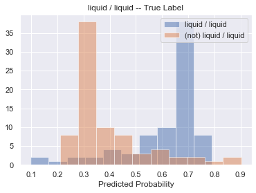


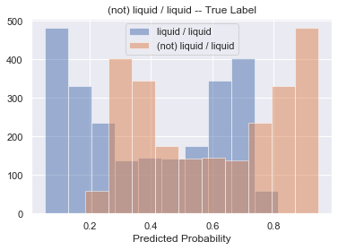


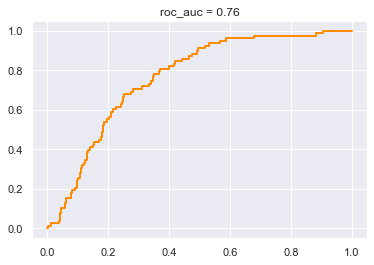

