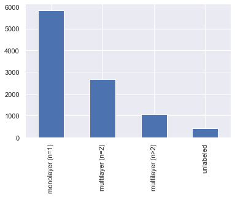
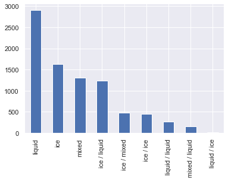
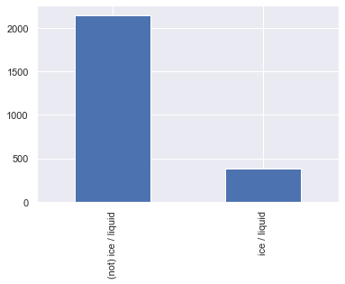

<h1 style='font-size:20px;text-align: center'>
A machine learning algorithm based on Gaussian processes 
for MODIS multilayer cloud and thermodynamic phase 
classification using CALIOP and CloudSat
</h1>

<p style='text-align: center'>
Author: Benjamin Marchant 
<br>(marchant.benjamin01@gmail.com)
<br>(benjamin.marchant@nasa.gov)
<br> v1.0.0
</p>

This Jupyter notebook presents a machine learning algorithm based on Gaussian processes to detect cloud thermodynamic phase and multilayer clouds for the MODIS (Moderate Resolution Imaging Spectroradiometer) instrument. The algorithm is trained using a co-located dataset between MODIS CALIOP and CloudSat.

Note 1: dataset used to train the algorithm is publicly available [on Github](https://github.com/benjamin-hg-marchant/ml-gp-modis-multilayer-clouds/tree/master/data).

Note 2: Main author open notebook can be found at the following <a href="https://moonbooks.org/Notebooks/6364d3f0f495b6ab9dcf8d3b5c6e0b01/">url</a>.


Table of Content:

* [Read MODIS CALIOP CLoudSat Co-located Dataset](#dataset)
* [Create cloud phase & multilayer cloud labels](#labels) 
* [Data Preparation (scaling and standardization)](#data_preparation)
* [Create a learning function](#learning_function)
* [Create an evaluation function](#evaluation_function)
* [Select MODIS bands that will be used to train the ML model ](#selected_modis_band)
* [Split the dataset between a training and testing dataset](#create_train_and_test_dataset)
* [Train a model that detect monolayer liquid cloud](#monolayer_liquid)
* [Train a model that detect monolayer ice cloud](#monolayer_ice)
* [Train a model that detect monolayer mixed cloud](#monolayer_mixed)
* [Train a model that detect multilayer (ice / liquid) cloud](#multilayer_ice_liquid)
* [Train a model that detect multilayer (ice / mixed) cloud](#multilayer_ice_mixed)
* [Train a model that detect multilayer (ice / ice) cloud](#multilayer_ice_ice)
* [Train a model that detect multilayer (liquid / liquid) cloud](#multilayer_liquid_liquid)
* [How to apply a machine learning model to a single MODIS granule ?](#modis_granule)
* [Conclusions](#conclusions)


```python
from sklearn.metrics import accuracy_score, log_loss
from sklearn.gaussian_process import GaussianProcessClassifier
from sklearn.gaussian_process.kernels import RBF
from sklearn.gaussian_process.kernels import DotProduct, ConstantKernel as C
from sklearn.model_selection import train_test_split
from sklearn import preprocessing
from sklearn.metrics import accuracy_score
from sklearn.metrics import confusion_matrix
from sklearn.utils import resample
from sklearn.metrics import roc_curve, auc
from sklearn.metrics import roc_auc_score
from sklearn.metrics import log_loss
from pyhdf.SD import SD, SDC 

from pyhdf.SD import SD, SDC 
from matplotlib.pyplot import figure
from random import shuffle 
from scipy.spatial.distance import pdist, cdist

import matplotlib.pyplot as plt
import matplotlib as mpl
import matplotlib.cm as cm
import pandas as pd
import numpy as np
import seaborn as sns; sns.set()
import numpy.ma as ma
import pprint
import warnings

warnings.filterwarnings('ignore')
```


```python
from IPython.core.display import HTML
HTML("""
<style>
.output_png {
    display: table-cell;
    text-align: center;
    vertical-align: middle;
}
</style>
""")
```


<style>
.output_png {
    display: table-cell;
    text-align: center;
    vertical-align: middle;
}
</style>


### Read MODIS CALIOP CLoudSat Co-located Dataset <a class="anchor" id="dataset"></a>

To train the algorithm, a co-located MODIS CALIOP and CloudSat Dataset has been created using random sampling of pixels selected during the month of January 2008 (5.000 pixels selected randomly each day -> dataset size 31*5000=155000):


```python
df = pd.read_csv('../data/2008_01_colocated_modis_caliop_cloudsat_random_sample_dataset.csv',index_col=False)

print('dataframe shape',df.shape)
```

    dataframe shape (155000, 113)


The file includes the following information:


```python
column_names_list = df.columns

for name in column_names_list:
    print(name)
```

    modis_multilayer_cloud
    modis_multilayer_cloud_qa1
    modis_multilayer_cloud_qa2
    modis_multilayer_cloud_qa3
    modis_multilayer_cloud_qa4
    modis_multilayer_cloud_qa5
    modis_cloud_phase
    latitude
    longitude
    modis_cloud_top_height_1km
    modis_cloud_effective_radius
    modis_cloud_effective_radius_16
    modis_cloud_effective_radius_37
    modis_cloud_optical_thickness
    surface_flag
    nb_tot_cloud_layers
    caliop_1km_nb_cloud_layers
    caliop_5km_nb_cloud_layers
    cldclass_lidar_nb_cloud_layers
    modis_band_1
    modis_band_2
    modis_band_3
    modis_band_4
    modis_band_5
    modis_band_6
    modis_band_7
    modis_band_8
    modis_band_9
    modis_band_10
    modis_band_11
    modis_band_12
    modis_band_13l
    modis_band_13h
    modis_band_14l
    modis_band_14h
    modis_band_15
    modis_band_16
    modis_band_17
    modis_band_18
    modis_band_19
    modis_band_26
    modis_band_20
    modis_band_21
    modis_band_22
    modis_band_23
    modis_band_24
    modis_band_25
    modis_band_27
    modis_band_28
    modis_band_29
    modis_band_30
    modis_band_31
    modis_band_32
    modis_band_33
    modis_band_34
    modis_band_35
    modis_band_36
    modis_band_1_atm_corr_refl
    modis_band_2_atm_corr_refl
    modis_band_5_atm_corr_refl
    modis_band_6_atm_corr_refl
    modis_band_7_atm_corr_refl
    modis_band_20_atm_corr_refl
    cloud_layer_top_01
    cloud_layer_base_01
    cloud_layer_optical_depth_01
    cloud_layer_phase_01
    cloud_layer_source_01
    cloud_layer_top_02
    cloud_layer_base_02
    cloud_layer_optical_depth_02
    cloud_layer_phase_02
    cloud_layer_source_02
    cloud_layer_top_03
    cloud_layer_base_03
    cloud_layer_optical_depth_03
    cloud_layer_phase_03
    cloud_layer_source_03
    cloud_layer_top_04
    cloud_layer_base_04
    cloud_layer_optical_depth_04
    cloud_layer_phase_04
    cloud_layer_source_04
    cloud_layer_top_05
    cloud_layer_base_05
    cloud_layer_optical_depth_05
    cloud_layer_phase_05
    cloud_layer_source_05
    cloud_layer_top_06
    cloud_layer_base_06
    cloud_layer_optical_depth_06
    cloud_layer_phase_06
    cloud_layer_source_06
    cloud_layer_top_07
    cloud_layer_base_07
    cloud_layer_optical_depth_07
    cloud_layer_phase_07
    cloud_layer_source_07
    cloud_layer_top_08
    cloud_layer_base_08
    cloud_layer_optical_depth_08
    cloud_layer_phase_08
    cloud_layer_source_08
    cloud_layer_top_09
    cloud_layer_base_09
    cloud_layer_optical_depth_09
    cloud_layer_phase_09
    cloud_layer_source_09
    cloud_layer_top_10
    cloud_layer_base_10
    cloud_layer_optical_depth_10
    cloud_layer_phase_10
    cloud_layer_source_10


```python
df.head(10)
```


<div>
<style scoped>
    .dataframe tbody tr th:only-of-type {
        vertical-align: middle;
    }

    .dataframe tbody tr th {
        vertical-align: top;
    }

    .dataframe thead th {
        text-align: right;
    }
</style>
<table border="1" class="dataframe">
  <thead>
    <tr style="text-align: right;">
      <th></th>
      <th>modis_multilayer_cloud</th>
      <th>modis_multilayer_cloud_qa1</th>
      <th>modis_multilayer_cloud_qa2</th>
      <th>modis_multilayer_cloud_qa3</th>
      <th>modis_multilayer_cloud_qa4</th>
      <th>modis_multilayer_cloud_qa5</th>
      <th>modis_cloud_phase</th>
      <th>latitude</th>
      <th>longitude</th>
      <th>modis_cloud_top_height_1km</th>
      <th>...</th>
      <th>cloud_layer_top_09</th>
      <th>cloud_layer_base_09</th>
      <th>cloud_layer_optical_depth_09</th>
      <th>cloud_layer_phase_09</th>
      <th>cloud_layer_source_09</th>
      <th>cloud_layer_top_10</th>
      <th>cloud_layer_base_10</th>
      <th>cloud_layer_optical_depth_10</th>
      <th>cloud_layer_phase_10</th>
      <th>cloud_layer_source_10</th>
    </tr>
  </thead>
  <tbody>
    <tr>
      <th>0</th>
      <td>5.0</td>
      <td>1.0</td>
      <td>0.0</td>
      <td>0.0</td>
      <td>0.0</td>
      <td>1.0</td>
      <td>2.0</td>
      <td>-49.767658</td>
      <td>-144.492096</td>
      <td>2700.0</td>
      <td>...</td>
      <td>0.000000</td>
      <td>0.000000</td>
      <td>-9999.0</td>
      <td>0.0</td>
      <td>0.0</td>
      <td>0.0</td>
      <td>0.0</td>
      <td>-9999.0</td>
      <td>0.0</td>
      <td>0.0</td>
    </tr>
    <tr>
      <th>1</th>
      <td>1.0</td>
      <td>0.0</td>
      <td>0.0</td>
      <td>0.0</td>
      <td>0.0</td>
      <td>0.0</td>
      <td>2.0</td>
      <td>7.892334</td>
      <td>87.800476</td>
      <td>4750.0</td>
      <td>...</td>
      <td>2.049999</td>
      <td>1.449999</td>
      <td>0.0</td>
      <td>3.0</td>
      <td>3.0</td>
      <td>0.0</td>
      <td>0.0</td>
      <td>-9999.0</td>
      <td>0.0</td>
      <td>0.0</td>
    </tr>
    <tr>
      <th>2</th>
      <td>1.0</td>
      <td>0.0</td>
      <td>0.0</td>
      <td>0.0</td>
      <td>0.0</td>
      <td>0.0</td>
      <td>2.0</td>
      <td>-52.644794</td>
      <td>29.831434</td>
      <td>500.0</td>
      <td>...</td>
      <td>0.000000</td>
      <td>0.000000</td>
      <td>-9999.0</td>
      <td>0.0</td>
      <td>0.0</td>
      <td>0.0</td>
      <td>0.0</td>
      <td>-9999.0</td>
      <td>0.0</td>
      <td>0.0</td>
    </tr>
    <tr>
      <th>3</th>
      <td>1.0</td>
      <td>0.0</td>
      <td>0.0</td>
      <td>0.0</td>
      <td>0.0</td>
      <td>0.0</td>
      <td>2.0</td>
      <td>28.681301</td>
      <td>-40.599194</td>
      <td>50.0</td>
      <td>...</td>
      <td>0.000000</td>
      <td>0.000000</td>
      <td>-9999.0</td>
      <td>0.0</td>
      <td>0.0</td>
      <td>0.0</td>
      <td>0.0</td>
      <td>-9999.0</td>
      <td>0.0</td>
      <td>0.0</td>
    </tr>
    <tr>
      <th>4</th>
      <td>1.0</td>
      <td>0.0</td>
      <td>0.0</td>
      <td>0.0</td>
      <td>0.0</td>
      <td>0.0</td>
      <td>2.0</td>
      <td>-67.958023</td>
      <td>-82.737038</td>
      <td>1250.0</td>
      <td>...</td>
      <td>0.000000</td>
      <td>0.000000</td>
      <td>-9999.0</td>
      <td>0.0</td>
      <td>0.0</td>
      <td>0.0</td>
      <td>0.0</td>
      <td>-9999.0</td>
      <td>0.0</td>
      <td>0.0</td>
    </tr>
    <tr>
      <th>5</th>
      <td>1.0</td>
      <td>0.0</td>
      <td>0.0</td>
      <td>0.0</td>
      <td>0.0</td>
      <td>0.0</td>
      <td>2.0</td>
      <td>-60.335007</td>
      <td>-138.910355</td>
      <td>850.0</td>
      <td>...</td>
      <td>0.000000</td>
      <td>0.000000</td>
      <td>-9999.0</td>
      <td>0.0</td>
      <td>0.0</td>
      <td>0.0</td>
      <td>0.0</td>
      <td>-9999.0</td>
      <td>0.0</td>
      <td>0.0</td>
    </tr>
    <tr>
      <th>6</th>
      <td>8.0</td>
      <td>0.0</td>
      <td>1.0</td>
      <td>1.0</td>
      <td>0.0</td>
      <td>1.0</td>
      <td>3.0</td>
      <td>-63.907398</td>
      <td>36.836395</td>
      <td>7450.0</td>
      <td>...</td>
      <td>0.000000</td>
      <td>0.000000</td>
      <td>-9999.0</td>
      <td>0.0</td>
      <td>0.0</td>
      <td>0.0</td>
      <td>0.0</td>
      <td>-9999.0</td>
      <td>0.0</td>
      <td>0.0</td>
    </tr>
    <tr>
      <th>7</th>
      <td>1.0</td>
      <td>0.0</td>
      <td>0.0</td>
      <td>0.0</td>
      <td>0.0</td>
      <td>0.0</td>
      <td>2.0</td>
      <td>-23.554411</td>
      <td>-4.174837</td>
      <td>0.0</td>
      <td>...</td>
      <td>0.000000</td>
      <td>0.000000</td>
      <td>-9999.0</td>
      <td>0.0</td>
      <td>0.0</td>
      <td>0.0</td>
      <td>0.0</td>
      <td>-9999.0</td>
      <td>0.0</td>
      <td>0.0</td>
    </tr>
    <tr>
      <th>8</th>
      <td>1.0</td>
      <td>0.0</td>
      <td>0.0</td>
      <td>0.0</td>
      <td>0.0</td>
      <td>0.0</td>
      <td>2.0</td>
      <td>-16.378271</td>
      <td>-30.564116</td>
      <td>2800.0</td>
      <td>...</td>
      <td>0.000000</td>
      <td>0.000000</td>
      <td>-9999.0</td>
      <td>0.0</td>
      <td>0.0</td>
      <td>0.0</td>
      <td>0.0</td>
      <td>-9999.0</td>
      <td>0.0</td>
      <td>0.0</td>
    </tr>
    <tr>
      <th>9</th>
      <td>0.0</td>
      <td>0.0</td>
      <td>0.0</td>
      <td>0.0</td>
      <td>0.0</td>
      <td>0.0</td>
      <td>4.0</td>
      <td>-6.938173</td>
      <td>115.692223</td>
      <td>7150.0</td>
      <td>...</td>
      <td>0.000000</td>
      <td>0.000000</td>
      <td>-9999.0</td>
      <td>0.0</td>
      <td>0.0</td>
      <td>0.0</td>
      <td>0.0</td>
      <td>-9999.0</td>
      <td>0.0</td>
      <td>0.0</td>
    </tr>
  </tbody>
</table>
<p>10 rows × 113 columns</p>
</div>


Remove rows with no data or clear pixels:


```python
df = df[df.modis_multilayer_cloud != 0]

print('dataframe shape',df.shape)
```

    dataframe shape (111558, 113)


```python
df['latitude'].plot(kind='hist',bins=50)

plt.xlabel('latitude')

plt.show()
```


Remove pixels with latitude > 70:


```python
df = df.loc[ abs( df['latitude'] ) < 70]

print('dataframe shape',df.shape)
```

    dataframe shape (101483, 113)


Gaussian processes are a "Lazy Learning" method (meaning that the training dataset will be used to make each new predictions). So it becomes slower with incrising the training dataset size. To avoid that, let's just take a smaller sample size: 


```python
df = df.sample(n=10000, random_state = 42)
#df = df.sample(n=10000)
#df = df.head(n=10000)
```


```python
df.shape
```


    (10000, 113)


### Create cloud phase & multilayer cloud labels <a class="anchor" id="labels"></a>

Using the cldclass-lidar product (corresponding to cloud_layer_source = 3) in the dataset, let's define monolayer and multilayer clouds labels that will be used to train the machine learning algorithm:


```python
df['label 1'] = 'unlabeled'
df['label 2'] = 'unlabeled'

#print(df.head())

for index, row in df.iterrows():
    nb_cloud_layer = 0
    cloud_phase_per_layer_list = []
    for layer_idx in range(10):
        if int( row['cloud_layer_source_{:02d}'.format(layer_idx+1)] ) == 3: # cldclass-lidar product
            cloud_phase_per_layer_list.append( int( row['cloud_layer_phase_{:02d}'.format(layer_idx+1)] ) )
            nb_cloud_layer = nb_cloud_layer + 1
    if nb_cloud_layer == 1: # monolayer cloud   
        df.loc[index,'label 1'] = 'monolayer (n=1)'
        if cloud_phase_per_layer_list[0] == 1: df.loc[index,'label 2'] = 'ice'
        if cloud_phase_per_layer_list[0] == 2: df.loc[index,'label 2'] = 'mixed'    
        if cloud_phase_per_layer_list[0] == 3: df.loc[index,'label 2'] = 'liquid'
    if nb_cloud_layer == 2: # multilayer cloud 
        df.loc[index,'label 1'] = 'multilayer (n=2)'
        if cloud_phase_per_layer_list[0] == 1 and cloud_phase_per_layer_list[1] == 1: 
            df.loc[index,'label 2'] = 'ice / ice'
        if cloud_phase_per_layer_list[0] == 1 and cloud_phase_per_layer_list[1] == 3: 
            df.loc[index,'label 2'] = 'ice / liquid'
        if cloud_phase_per_layer_list[0] == 1 and cloud_phase_per_layer_list[1] == 2: 
            df.loc[index,'label 2'] = 'ice / mixed'
        if cloud_phase_per_layer_list[0] == 3 and cloud_phase_per_layer_list[1] == 3: 
            df.loc[index,'label 2'] = 'liquid / liquid'
        if cloud_phase_per_layer_list[0] == 2 and cloud_phase_per_layer_list[1] == 3: 
            df.loc[index,'label 2'] = 'mixed / liquid'    
        if cloud_phase_per_layer_list[0] == 3 and cloud_phase_per_layer_list[1] == 1: 
            df.loc[index,'label 2'] = 'liquid / ice'
    if nb_cloud_layer > 2: # multilayer cloud 
        df.loc[index,'label 1'] = 'multilayer (n>2)'
```


```python
df['label 1'].value_counts()
```


    monolayer (n=1)     5842
    multilayer (n=2)    2661
    multilayer (n>2)    1079
    unlabeled            418
    Name: label 1, dtype: int64


```python
df['label 1'].value_counts().plot(kind='pie', figsize=(8, 8))

plt.show()
```


```python
df['label 1'].value_counts().plot(kind='bar')

plt.show()
```





```python
df['label 2'].value_counts()
```


    liquid             2908
    ice                1624
    unlabeled          1560
    mixed              1310
    ice / liquid       1237
    ice / mixed         479
    ice / ice           452
    liquid / liquid     271
    mixed / liquid      151
    liquid / ice          8
    Name: label 2, dtype: int64


```python
df['label 2'].value_counts().plot(kind='bar')

plt.show()
```


```python
df.drop( df[(df['label 1'] == 'unlabeled' ) | (df['label 2'] == 'unlabeled')].index, inplace=True )

print(df.shape)
```

    (8440, 115)


```python
df['label 2'].value_counts().plot(kind='bar')

plt.savefig('output.png', bbox_inches='tight')
plt.show()
```





### Data Preparation (scaling and standardization) <a class="anchor" id="data_preparation"></a>

Create a function that prepare the data:


```python
def data_preparation(df_train, df_test, max_train_sample_size, label_name, features_train):

    df_train_processed = df_train.copy()
    df_test_processed = df_test.copy()
    
    #----- data class balanced -----#    
    
    print(df_train_processed['label 2'].value_counts())
    
    df_train_processed['label 2'][ df_train_processed['label 2'] != label_name ] = '(not) ' + label_name
 
    df_train_processed['label 2'].value_counts().plot(kind='bar')

    plt.show()  

    #----- data class balanced -----#     
    
    # Separate majority and minority classes
    df_majority = df_train_processed[ df_train_processed['label 2'] != label_name ]
    df_minority = df_train_processed[ df_train_processed['label 2'] == label_name ]
    
    df_minority_len = len(df_minority)
    
    # Downsample majority class
    df_majority_downsampled = resample(df_majority, 
                                     replace=False,    # sample without replacement
                                     n_samples=df_minority_len,     # to match minority class
                                     random_state=123) # reproducible results

    # Combine minority class with downsampled majority class
    df_train_processed = pd.concat([df_majority_downsampled, df_minority])
    
    #print(df_train_processed)
    
    print(df_train_processed['label 2'].value_counts())

    df_train_processed['label 2'].value_counts().plot(kind='bar')

    plt.show() 
    
    #----- data train scaling -----#
    
    X_train = df_train_processed[features_train]

    scaler = preprocessing.StandardScaler().fit(X_train)

    X_train_scaled = scaler.transform(X_train)
    
    df_train_processed[features_train] = X_train_scaled
        
    #----- data test scaling -----#    
    
    X_test_scaled = scaler.transform(df_test_processed[features_train])
    
    df_test_processed[features_train] = X_test_scaled
    
    df_test_processed['label 2'][ df_test_processed['label 2'] != label_name ] = '(not) ' + label_name
    
    #----- data sub sampling -----#
    
    if df_minority_len * 2.0 > max_train_sample_size:

        df_majority = df_train_processed[ df_train_processed['label 2'] != label_name ]
        df_minority = df_train_processed[ df_train_processed['label 2'] == label_name ]    

        df_majority = df_majority.sample(n=int(max_train_sample_size/2.0), random_state=42)
        df_minority = df_minority.sample(n=int(max_train_sample_size/2.0), random_state=42)

        df_train_processed = pd.concat([df_majority, df_minority])

        df_train_processed['label 2'].value_counts().plot(kind='bar')

        plt.show()     

    return scaler, df_train_processed, df_test_processed
```

### Create a learning function<a class="anchor" id="learning_function"></a>


```python
def train_gp_model(label_name, features_train, df_train_processed):
    
    kernel = C(1.0, (0.1, 10.0)) * RBF([0.2,0.2,0.2,0.2,0.2,0.2,0.2,0.2], (1e-2, 1e2))

    gp = GaussianProcessClassifier(kernel=kernel, n_restarts_optimizer=20)
    
    gp.fit(df_train_processed[features_train], df_train_processed['label 2'])
    
    return gp
```

### Create an evaluation function <a class="anchor" id="evaluation_function"></a>


```python
def evaluate_gp_model(label_name, features_train, gp, df_test_processed):
        
    y_true = df_test_processed['label 2']
    y_pred = gp.predict_proba(df_test_processed[features_train])
    
    df_test_processed['label 2'].value_counts().plot(kind='bar')

    plt.show() 

    y_pred_list = []
    y_liq_liq_list = []
    y_liq_notliq_list = []
    y_notliq_liq_list = []
    y_notliq_notliq_list = []
    for i in range(y_pred.shape[0]):
        #print(y_pred[i,0],y_pred[i,1],y_true.iloc[i])
        if y_pred[i,0] >= 0.5:
            y_pred_list.append('(not) ' + label_name)
        else:
            y_pred_list.append(label_name)
        if y_true.iloc[i] == label_name:
            y_liq_liq_list.append(y_pred[i,1])
            y_liq_notliq_list.append(y_pred[i,0])  
        else:
            y_notliq_liq_list.append(y_pred[i,1])
            y_notliq_notliq_list.append(y_pred[i,0])                       
    
    print('accuracy_score:',accuracy_score(y_true, y_pred_list))  
    
    cm_data = confusion_matrix(y_true, y_pred_list) 

    #print(cm_data)
    
    label_list = ['(not) ' + label_name, label_name]
    label_list.sort()

    #df_cm = pd.DataFrame(100.0*cm_data/np.sum(cm_data), index = label_list, columns = label_list)

    #sns.heatmap(df_cm, annot=True)

    #plt.show()
    #plt.close()    
    
    plt.hist(y_liq_liq_list, alpha = 0.5, label=label_name)
    
    plt.hist(y_liq_notliq_list, alpha = 0.5, label='(not) ' + label_name)
    
    plt.title(label_name + ' -- True Label')
    
    plt.xlabel('Predicted Probability')
    plt.legend()
    
    plt.show()   
    
    plt.hist(y_notliq_liq_list, alpha = 0.5, label=label_name)
    
    plt.hist(y_notliq_notliq_list, alpha = 0.5, label='(not) ' + label_name)
    
    plt.title('(not) ' + label_name + ' -- True Label')
    
    plt.xlabel('Predicted Probability')
    
    plt.legend()
    
    plt.show()   
        
    fpr, tpr, _ = roc_curve(y_true, y_pred[:,1], pos_label=label_name)
    
    roc_auc = auc(fpr, tpr)
    plt.title('roc_auc = %0.2f' % roc_auc)
    
    lw = 2
    plt.plot(fpr, tpr, color='darkorange', lw=lw, label='ROC curve (area = %0.2f)' % roc_auc)
    
    plt.show()

    #print('log_loss', log_loss(y_true, y_pred))

    return None
```

### Select MODIS bands that will be used to train the ML model <a class="anchor" id="selected_modis_band"></a>


```python
features_train = ['modis_band_1','modis_band_7','modis_band_20',
                  'modis_band_26','modis_band_28','modis_band_29',
                  'modis_band_31','modis_band_32']

sub_df = df[features_train + ['label 1','label 2']]
```

### Split the dataset between a training and testing dataset:  <a class="anchor" id="create_train_and_test_dataset"></a>


```python
df_train, df_test = train_test_split(sub_df, test_size = .3, random_state = 42)

print(df_train.shape)
```

    (5908, 10)


### Train a model that detect monolayer liquid cloud <a class="anchor" id="monolayer_liquid"></a>


```python
%%time

scaler_liquid, df_train_liquid_processed, df_test_liquid_processed = data_preparation(
                                            df_train, 
                                            df_test, 
                                            max_train_sample_size = 100, 
                                            label_name = 'liquid', features_train = features_train)
```

    liquid             2064
    ice                1124
    mixed               900
    ice / liquid        855
    ice / mixed         333
    ice / ice           331
    liquid / liquid     193
    mixed / liquid      103
    liquid / ice          5
    Name: label 2, dtype: int64


    (not) liquid    2064
    liquid          2064
    Name: label 2, dtype: int64


    CPU times: user 334 ms, sys: 6.96 ms, total: 341 ms
    Wall time: 339 ms


```python
%%time

gp_liquid = train_gp_model('liquid', features_train, df_train_liquid_processed)
```

    CPU times: user 4.8 s, sys: 32.8 ms, total: 4.83 s
    Wall time: 2.5 s


```python
%%time

evaluate_gp_model('liquid', features_train, gp_liquid, df_test_liquid_processed)
```


    accuracy_score: 0.7729067930489731


    CPU times: user 1.01 s, sys: 14.5 ms, total: 1.02 s
    Wall time: 817 ms


### Train a model that detect monolayer ice cloud <a class="anchor" id="monolayer_ice"></a>


```python
scaler_ice, df_train_ice_processed, df_test_ice_processed = data_preparation(
                                        df_train, 
                                        df_test, 
                                        max_train_sample_size = 100, 
                                        label_name = 'ice', features_train = features_train)
```

    liquid             2064
    ice                1124
    mixed               900
    ice / liquid        855
    ice / mixed         333
    ice / ice           331
    liquid / liquid     193
    mixed / liquid      103
    liquid / ice          5
    Name: label 2, dtype: int64


    ice          1124
    (not) ice    1124
    Name: label 2, dtype: int64


```python
gp_ice = train_gp_model('ice', features_train, df_train_ice_processed)
```


```python
evaluate_gp_model('ice', features_train, gp_ice, df_test_ice_processed)
```


    accuracy_score: 0.7417061611374408


### Train a model that detect monolayer mixed cloud <a class="anchor" id="monolayer_mixed"></a>


```python
scaler_mixed, df_train_mixed_processed, df_test_mixed_processed = data_preparation(
                                        df_train, 
                                        df_test, 
                                        max_train_sample_size = 100, 
                                        label_name = 'mixed', features_train = features_train)
```

    liquid             2064
    ice                1124
    mixed               900
    ice / liquid        855
    ice / mixed         333
    ice / ice           331
    liquid / liquid     193
    mixed / liquid      103
    liquid / ice          5
    Name: label 2, dtype: int64


    mixed          900
    (not) mixed    900
    Name: label 2, dtype: int64


```python
%%time

features_train = ['modis_band_1','modis_band_7','modis_band_20',
                  'modis_band_26','modis_band_28','modis_band_29',
                  'modis_band_31','modis_band_32']

gp_mixed = train_gp_model('mixed', features_train, df_train_mixed_processed)
```

    CPU times: user 6.12 s, sys: 44.1 ms, total: 6.17 s
    Wall time: 3.13 s


```python
evaluate_gp_model('mixed', features_train, gp_mixed, df_test_mixed_processed)
```


    accuracy_score: 0.6303317535545023


### Train a model that detect multilayer (ice / liquid) cloud <a class="anchor" id="multilayer_ice_liquid"></a>


```python
scaler_ice_over_liquid, df_train_ice_over_liquid_processed, df_test_ice_over_liquid_processed = data_preparation(
                                        df_train, 
                                        df_test, 
                                        max_train_sample_size = 500, 
                                        label_name = 'ice / liquid', features_train = features_train)
```

    liquid             2064
    ice                1124
    mixed               900
    ice / liquid        855
    ice / mixed         333
    ice / ice           331
    liquid / liquid     193
    mixed / liquid      103
    liquid / ice          5
    Name: label 2, dtype: int64


    ice / liquid          855
    (not) ice / liquid    855
    Name: label 2, dtype: int64


```python
%%time

features_train = ['modis_band_1','modis_band_7','modis_band_20',
                  'modis_band_26','modis_band_28','modis_band_29',
                  'modis_band_31','modis_band_32']

gp_ice_over_liquid = train_gp_model('ice / liquid', features_train, df_train_ice_over_liquid_processed)
```

    CPU times: user 2min 9s, sys: 8.84 s, total: 2min 18s
    Wall time: 1min 9s


```python
evaluate_gp_model('ice / liquid', features_train, gp_ice_over_liquid, df_test_ice_over_liquid_processed)
```





    accuracy_score: 0.6184834123222749


### Train a model that detect multilayer (ice / mixed) cloud <a class="anchor" id="multilayer_ice_mixed"></a>


```python
scaler_ice_over_mixed, df_train_ice_over_mixed_processed, df_test_ice_over_mixed_processed = data_preparation(
                                        df_train, 
                                        df_test, 
                                        max_train_sample_size = 100, 
                                        label_name = 'ice / mixed', features_train = features_train)
```

    liquid             2064
    ice                1124
    mixed               900
    ice / liquid        855
    ice / mixed         333
    ice / ice           331
    liquid / liquid     193
    mixed / liquid      103
    liquid / ice          5
    Name: label 2, dtype: int64


    (not) ice / mixed    333
    ice / mixed          333
    Name: label 2, dtype: int64


```python
%%time

features_train = ['modis_band_1','modis_band_7','modis_band_20',
                  'modis_band_26','modis_band_28','modis_band_29',
                  'modis_band_31','modis_band_32']

gp_ice_over_mixed = train_gp_model('ice / mixed', features_train, df_train_ice_over_mixed_processed)
```

    CPU times: user 5.66 s, sys: 59.6 ms, total: 5.71 s
    Wall time: 3.07 s


```python
evaluate_gp_model('ice / mixed', features_train, gp_ice_over_mixed, df_test_ice_over_mixed_processed)
```


    accuracy_score: 0.5217219589257504


### Train a model that detect multilayer (ice / ice) cloud <a class="anchor" id="multilayer_ice_ice"></a>


```python
scaler_ice_over_ice, df_train_ice_over_ice_processed, df_test_ice_over_ice_processed = data_preparation(
                                        df_train, 
                                        df_test, 
                                        max_train_sample_size = 100, 
                                        label_name = 'ice / ice', features_train = features_train)
```

    liquid             2064
    ice                1124
    mixed               900
    ice / liquid        855
    ice / mixed         333
    ice / ice           331
    liquid / liquid     193
    mixed / liquid      103
    liquid / ice          5
    Name: label 2, dtype: int64


    ice / ice          331
    (not) ice / ice    331
    Name: label 2, dtype: int64


```python
%%time

features_train = ['modis_band_1','modis_band_7','modis_band_20',
                  'modis_band_26','modis_band_28','modis_band_29',
                  'modis_band_31','modis_band_32']

gp_ice_over_ice = train_gp_model('ice / ice', features_train, df_train_ice_over_ice_processed)
```

    CPU times: user 6.48 s, sys: 42.3 ms, total: 6.52 s
    Wall time: 3.31 s


```python
evaluate_gp_model('ice / ice', features_train, gp_ice_over_ice, df_test_ice_over_ice_processed)
```


    accuracy_score: 0.6212480252764613


### Train a model that detect multilayer (liquid / liquid) cloud <a class="anchor" id="multilayer_liquid_liquid"></a>


```python
scaler_liquid_over_liquid, df_train_liq_over_liq_processed, df_test_liq_over_liq_processed = data_preparation(
                                        df_train, 
                                        df_test, 
                                        max_train_sample_size = 100, 
                                        label_name = 'liquid / liquid', features_train = features_train)
```

    liquid             2064
    ice                1124
    mixed               900
    ice / liquid        855
    ice / mixed         333
    ice / ice           331
    liquid / liquid     193
    mixed / liquid      103
    liquid / ice          5
    Name: label 2, dtype: int64


    (not) liquid / liquid    193
    liquid / liquid          193
    Name: label 2, dtype: int64


```python
%%time

features_train = ['modis_band_1','modis_band_7','modis_band_20',
                  'modis_band_26','modis_band_28','modis_band_29',
                  'modis_band_31','modis_band_32']

gp_liq_over_liq = train_gp_model('liquid / liquid', features_train, df_train_liq_over_liq_processed)
```

    CPU times: user 6.3 s, sys: 47.8 ms, total: 6.35 s
    Wall time: 3.23 s


```python
evaluate_gp_model('liquid / liquid', features_train, gp_liq_over_liq, df_test_liq_over_liq_processed)
```


    accuracy_score: 0.6015007898894155


### How to apply a machine learning model to a single MODIS granule ? <a class="anchor" id="modis_granule"></a>

In this section, we will see how to develop an algorihtm to apply previous ML models (based on Gaussian processes) to a single MODIS granule. For that we will use the following products: 

- MODIS MYD021KM L1
- MODIS MYD06 L2 Cloud Mask (to select only cloudy pixels to apply ML models)
- MODIS MYD06 L2 Cloud Phase (only to make some comparisons with the ML models)
- MODIS MYD06 L2 Multilayer Clouds (only to make some comparisons with the ML models)


```python
myd021km_file = SD('../data/MYD021KM.A2008015.1435.006.2012066180438.hdf', SDC.READ)
myd06_file = SD('../data/MYD06_L2.A2008015.1435.006.2013342100940.hdf', SDC.READ)
```

Create a function to plot MODIS MYD06 L2 Cloud Mask:


```python
def bits_stripping(bit_start,bit_count,value):
    bitmask=pow(2,bit_start+bit_count)-1
    return np.right_shift(np.bitwise_and(value,bitmask),bit_start)

def plot_MODIS_L2_Cloud_Mask_1km(cloud_mask_flag):
    figure(num=None, figsize=(12, 10), dpi=80, facecolor='w', edgecolor='k')
    #cmap =  [(1.0,1.0,1.0)] + [(1.0, 0.0, 0.0)] + [(65.0/255,105.0/255,225.0/255)] + [(0.0,0.0,0.0)]
    #cmap = sns.mpl_palette("Set1", 4)
    cmap = sns.color_palette("RdBu", n_colors=4)
    cmap = mpl.colors.ListedColormap(cmap)
    bounds = [-0.5, 0.5, 1.5, 2.5, 3.5]
    norm = mpl.colors.BoundaryNorm(bounds, cmap.N)
    img = plt.imshow(np.fliplr(cloud_mask_flag), cmap=cmap, norm=norm,interpolation='none', origin='lower')
    cbar_bounds = [-0.5, 0.5, 1.5, 2.5, 3.5]
    cbar_ticks = [ 0, 1, 2, 3]  
    cbar_labels = ['Confident Cloudy', 'Probably Cloudy','Probably Clear ','Confident Clear']  
    cbar = plt.colorbar(img, cmap=cmap, norm=norm, boundaries=cbar_bounds, ticks=cbar_ticks)
    cbar.ax.set_yticklabels(cbar_labels, fontsize=11)
    plt.title('MODIS MYD06 C6 Cloud Mask 1km', fontsize=11)
    l = [int(i) for i in np.linspace(0,data.shape[1],6)]
    plt.xticks(l, [i for i in reversed(l)], rotation=0, fontsize=11 )
    l = [int(i) for i in np.linspace(0,data.shape[0],9)]
    plt.yticks(l, l, rotation=0, fontsize=11 )
    plt.xticks(fontsize=11)
    plt.yticks(fontsize=11)
    plt.show()
```


```python
data_selected_id = myd06_file.select('Cloud_Mask_1km')
data = data_selected_id.get()   
cloud_mask_flag = bits_stripping(1,2,data[:,:,0])
plot_MODIS_L2_Cloud_Mask_1km(cloud_mask_flag)  
```


Create a function to plot MODIS MYD06 L2 Cloud Phase:


```python
def plot_MODIS_L2_Cloud_Phase_Optical_Properties(data):
    figure(num=None, figsize=(12, 10), dpi=80, facecolor='w', edgecolor='k')
    cmap = sns.color_palette("RdBu_r", n_colors=4)
    cmap = mpl.colors.ListedColormap(cmap)
    bounds = [-0.5, 1.5, 2.5, 3.5, 4.5]
    norm = mpl.colors.BoundaryNorm(bounds, cmap.N)
    img = plt.imshow(np.fliplr(data), cmap=cmap, norm=norm,interpolation='none', origin='lower')
    cbar_bounds = [0.5,1.5, 2.5, 3.5, 4.5]
    cbar_ticks = [1.0,2.0,3.0,4.0]  
    cbar_labels = ['clear','Liquid','Ice','Und.']  
    cbar = plt.colorbar(img, cmap=cmap, norm=norm, boundaries=cbar_bounds, ticks=cbar_ticks)
    cbar.ax.set_yticklabels(cbar_labels, fontsize=10)
    plt.title('MODIS MYD06 C6 \n Cloud Phase Optical Properties', fontsize=11)
    l = [int(i) for i in np.linspace(0,data.shape[1],6)]
    plt.xticks(l, [i for i in reversed(l)], rotation=0, fontsize=11 )
    l = [int(i) for i in np.linspace(0,data.shape[0],9)]
    plt.yticks(l, l, rotation=0, fontsize=11 )
    plt.xticks(fontsize=11)
    plt.yticks(fontsize=11)
    plt.show()
```


```python
data_selected_id = myd06_file.select('Cloud_Phase_Optical_Properties')
data = data_selected_id.get()
plot_MODIS_L2_Cloud_Phase_Optical_Properties(data)   
```


Create a function to plot MODIS MYD06 L2 Multilayer Clouds:


```python
def plot_multilayer_clouds(data):
    figure(num=None, figsize=(12, 10), dpi=80, facecolor='w', edgecolor='k')
    cmap = sns.color_palette('RdBu_r', n_colors=10)
    cmap = mpl.colors.ListedColormap(cmap)
    bounds = [-0.5, 1.5,2.5,3.5,4.5,5.5,6.5,7.5,8.5,9.5]
    norm = mpl.colors.BoundaryNorm(bounds, cmap.N)
    img = plt.imshow(np.fliplr(data), cmap=cmap, norm=norm,interpolation='none', origin='lower')
    cbar_bounds = [-0.5,0.5, 1.5,2.5,3.5,4.5,5.5,6.5,7.5,8.5,9.5]
    cbar_ticks = [0,1,2,3,4,5,6,7,8,9]               
    cbar = plt.colorbar(img, cmap=cmap, norm=norm, boundaries=cbar_bounds, ticks=cbar_ticks)
    cbar.ax.set_yticklabels(cbar_ticks, fontsize=10)
    plt.title('MODIS MYD06 C6 \n Multilayer Clouds', fontsize=11)
    l = [int(i) for i in np.linspace(0,data.shape[1],6)]
    plt.xticks(l, [i for i in reversed(l)], rotation=0, fontsize=11 )
    l = [int(i) for i in np.linspace(0,data.shape[0],9)]
    plt.yticks(l, l, rotation=0, fontsize=11 )
    plt.xticks(fontsize=11)
    plt.yticks(fontsize=11)
    plt.show()
```


```python
data_selected_id = myd06_file.select('Cloud_Multi_Layer_Flag')

data = data_selected_id.get()
data_selected_attributes = data_selected_id.attributes()
plot_multilayer_clouds(data)
```


Read and create a function to plot MODIS MYD021KM L1:


```python
EV_250_Aggr1km_RefSB = myd021km_file.select('EV_250_Aggr1km_RefSB')
EV_500_Aggr1km_RefSB = myd021km_file.select('EV_500_Aggr1km_RefSB')
EV_1KM_RefSB = myd021km_file.select('EV_1KM_RefSB')
EV_1KM_Emissive = myd021km_file.select('EV_1KM_Emissive')
```

First, lets create a dictionary that will store for each MODIS band the corresponding SDS name and index: 


```python
modis_band_dic = {}
```


```python
#print( EV_250_Aggr1km_RefSB.info() )
EV_250_Aggr1km_RefSB_attributes = EV_250_Aggr1km_RefSB.attributes()
EV_250_Aggr1km_RefSB_scales = EV_250_Aggr1km_RefSB_attributes['reflectance_scales']
EV_250_Aggr1km_RefSB_offsets = EV_250_Aggr1km_RefSB_attributes['reflectance_offsets']
#pprint.pprint(EV_250_Aggr1km_RefSB_attributes )

for idx,i in enumerate(EV_250_Aggr1km_RefSB_attributes['band_names'].split(',')):
    print(idx,i)    
    modis_band_dic[i] = [EV_250_Aggr1km_RefSB,idx]
```

    0 1
    1 2


```python
#print( EV_500_Aggr1km_RefSB.info() )
EV_500_Aggr1km_RefSB_attributes = EV_500_Aggr1km_RefSB.attributes()
EV_500_Aggr1km_RefSB_scales = EV_500_Aggr1km_RefSB_attributes['reflectance_scales']
EV_500_Aggr1km_RefSB_offsets = EV_500_Aggr1km_RefSB_attributes['reflectance_offsets']
#pprint.pprint(EV_500_Aggr1km_RefSB_attributes )

for idx,i in enumerate(EV_500_Aggr1km_RefSB_attributes['band_names'].split(',')):
    print(idx,i)
    modis_band_dic[i] = [EV_500_Aggr1km_RefSB,idx]
```

    0 3
    1 4
    2 5
    3 6
    4 7


```python
#print( EV_1KM_RefSB.info() )
EV_1KM_RefSB_attributes = EV_1KM_RefSB.attributes()
EV_1KM_RefSB_scales = EV_1KM_RefSB_attributes['reflectance_scales']
EV_1KM_RefSB_offsets = EV_1KM_RefSB_attributes['reflectance_offsets']
#pprint.pprint(EV_1KM_RefSB_attributes )

for idx,i in enumerate(EV_1KM_RefSB_attributes['band_names'].split(',')):
    print(idx,i)
    modis_band_dic[i] = [EV_1KM_RefSB,idx]
```

    0 8
    1 9
    2 10
    3 11
    4 12
    5 13lo
    6 13hi
    7 14lo
    8 14hi
    9 15
    10 16
    11 17
    12 18
    13 19
    14 26


```python
print( EV_1KM_Emissive.info() )
EV_1KM_Emissive_attributes = EV_1KM_Emissive.attributes()
EV_1KM_Emissive_scales = EV_1KM_Emissive_attributes['radiance_scales']
EV_1KM_Emissive_offsets = EV_1KM_Emissive_attributes['radiance_offsets']
#pprint.pprint(EV_1KM_Emissive_attributes )

for idx,i in enumerate(EV_1KM_Emissive_attributes['band_names'].split(',')):
    print(idx,i)
    modis_band_dic[i] = [EV_1KM_Emissive,idx]
```

    ('EV_1KM_Emissive', 3, [16, 2030, 1354], 23, 8)
    0 20
    1 21
    2 22
    3 23
    4 24
    5 25
    6 27
    7 28
    8 29
    9 30
    10 31
    11 32
    12 33
    13 34
    14 35
    15 36


```python
for key in modis_band_dic:
    print(key, modis_band_dic[key][0].info()[0], modis_band_dic[key][1])
```

    1 EV_250_Aggr1km_RefSB 0
    2 EV_250_Aggr1km_RefSB 1
    3 EV_500_Aggr1km_RefSB 0
    4 EV_500_Aggr1km_RefSB 1
    5 EV_500_Aggr1km_RefSB 2
    6 EV_500_Aggr1km_RefSB 3
    7 EV_500_Aggr1km_RefSB 4
    8 EV_1KM_RefSB 0
    9 EV_1KM_RefSB 1
    10 EV_1KM_RefSB 2
    11 EV_1KM_RefSB 3
    12 EV_1KM_RefSB 4
    13lo EV_1KM_RefSB 5
    13hi EV_1KM_RefSB 6
    14lo EV_1KM_RefSB 7
    14hi EV_1KM_RefSB 8
    15 EV_1KM_RefSB 9
    16 EV_1KM_RefSB 10
    17 EV_1KM_RefSB 11
    18 EV_1KM_RefSB 12
    19 EV_1KM_RefSB 13
    26 EV_1KM_RefSB 14
    20 EV_1KM_Emissive 0
    21 EV_1KM_Emissive 1
    22 EV_1KM_Emissive 2
    23 EV_1KM_Emissive 3
    24 EV_1KM_Emissive 4
    25 EV_1KM_Emissive 5
    27 EV_1KM_Emissive 6
    28 EV_1KM_Emissive 7
    29 EV_1KM_Emissive 8
    30 EV_1KM_Emissive 9
    31 EV_1KM_Emissive 10
    32 EV_1KM_Emissive 11
    33 EV_1KM_Emissive 12
    34 EV_1KM_Emissive 13
    35 EV_1KM_Emissive 14
    36 EV_1KM_Emissive 15


```python
def plot_MODIS_L1(MODIS_band, modis_band_dic):

    data_selected_id = modis_band_dic[str(MODIS_band)][0]
    band_idx = modis_band_dic[str(MODIS_band)][1]
    title = 'MODIS Band' + str(MODIS_band)
    
    figure(num=None, figsize=(12, 10), dpi=80, facecolor='w', edgecolor='k')

    data = data_selected_id.get()
    data_selected_band = data[band_idx,:,:]
    data_selected_attributes = data_selected_id.attributes()
    _FillValue = data_selected_attributes['_FillValue']
    _FillValue = 65528 # warning wrong _FillValue stored in attributes    

    if modis_band_dic[str(MODIS_band)][0].info()[0] == 'EV_1KM_Emissive':
    
        radiance_scales = data_selected_attributes['radiance_scales']
        radiance_offsets = data_selected_attributes['radiance_offsets']
        data_selected_band[ data_selected_band == _FillValue ] = 0.0
        data_selected_band = (data_selected_band - radiance_offsets[band_idx]) * radiance_scales[band_idx]    
    
    else:
    
        reflectance_scales = data_selected_attributes['reflectance_scales']
        data_selected_band[ data_selected_band == _FillValue ] = 0.0
        data_selected_band = data_selected_band * reflectance_scales[band_idx]

    cmap = [(0.0,0.0,0.0)] + [(cm.jet(i)) for i in range(1,256)] 
    cmap = mpl.colors.ListedColormap(cmap)
    img = plt.imshow(np.fliplr(data_selected_band), cmap=cmap,interpolation='none', origin='lower')
    plt.title(title, fontsize=11)
    cbar = plt.colorbar()
    cbar.ax.tick_params(labelsize=8)
    l = [int(i) for i in np.linspace(0,data_selected_band.shape[1],6)]
    plt.xticks(l, [i for i in reversed(l)], rotation=0, fontsize=11 )
    l = [int(i) for i in np.linspace(0,data_selected_band.shape[0],9)]
    plt.yticks(l, l, rotation=0, fontsize=11 )
    plt.xticks(fontsize=11)
    plt.yticks(fontsize=11)    
    plt.show()
    
plot_MODIS_L1(6,modis_band_dic)
plot_MODIS_L1(7,modis_band_dic)
plot_MODIS_L1(28,modis_band_dic)
plot_MODIS_L1(29,modis_band_dic)
```


Now let's see how to apply ML models created previously to all cloudy pixels of a single MODIS granule. For that we will vectorize the MODIS cloudy pixels (instead of creating a for loop on every granule pixels which will be quite slow).

First, let's create a function that select only cloudy or probably cloudy pixels:


```python
A = np.argwhere( cloud_mask_flag < 2 ) # cloudy pixels
row = A[:,0]
col = A[:,1]

def select_cloudy_pixel_only(data):
    data_masked = ma.masked_where( cloud_mask_flag > 1, data)
    return np.ma.compressed(data_masked)
```

Get the MODIS L1 data:


```python
EV_250_Aggr1km_RefSB_data = EV_250_Aggr1km_RefSB.get()
EV_500_Aggr1km_RefSB_data = EV_500_Aggr1km_RefSB.get()
EV_1KM_RefSB_data = EV_1KM_RefSB.get()
EV_1KM_Emissive_data = EV_1KM_Emissive.get()
```


```python
def vectorize_modis_l1(features_train, modis_band_dic):
    
    X_list = []
    
    for feature in features_train:
    
        modis_band = feature.replace('modis_band_','')  
        modis_band_idx = modis_band_dic[modis_band][1]
        
        if modis_band_dic[modis_band][0].info()[0] == 'EV_250_Aggr1km_RefSB':
            data_band = EV_250_Aggr1km_RefSB_data[modis_band_idx,:,:]
            data_band = (data_band - EV_250_Aggr1km_RefSB_offsets[modis_band_idx]) * EV_250_Aggr1km_RefSB_scales[modis_band_idx]
  
        if modis_band_dic[modis_band][0].info()[0] == 'EV_500_Aggr1km_RefSB':
            data_band = EV_500_Aggr1km_RefSB_data[modis_band_idx,:,:]
            data_band = (data_band - EV_500_Aggr1km_RefSB_offsets[modis_band_idx]) * EV_500_Aggr1km_RefSB_scales[modis_band_idx]
            
        if modis_band_dic[modis_band][0].info()[0] == 'EV_1KM_RefSB':
            data_band = EV_1KM_RefSB_data[modis_band_idx,:,:]
            data_band = (data_band - EV_1KM_RefSB_scales[modis_band_idx]) * EV_1KM_RefSB_scales[modis_band_idx]
            
        if modis_band_dic[modis_band][0].info()[0] == 'EV_1KM_Emissive':
            data_band = EV_1KM_Emissive_data[modis_band_idx,:,:] 
            data_band = (data_band - EV_1KM_Emissive_offsets[modis_band_idx]) * EV_1KM_Emissive_scales[modis_band_idx]

        X_list.append( select_cloudy_pixel_only(data_band) )
        
    return np.stack(X_list, axis=-1)
```


```python
features_train = ['modis_band_1','modis_band_7','modis_band_20',
                  'modis_band_26','modis_band_28','modis_band_29',
                  'modis_band_31','modis_band_32']

X = vectorize_modis_l1(features_train, modis_band_dic)

print(X.shape)
```

    (2016074, 8)


```python
X_scaled = scaler_liquid.transform(X)
```


```python
%%time

gp_liquid_y_prob = gp_liquid.predict_proba(X_scaled)
```

    CPU times: user 8.28 s, sys: 3.01 s, total: 11.3 s
    Wall time: 9.97 s


```python
def plot_y_prob(data, title):
    figure(num=None, figsize=(12, 10), dpi=80, facecolor='w', edgecolor='k')
    cmap = sns.color_palette("RdBu_r", n_colors=10)
    cmap = mpl.colors.ListedColormap(cmap)
    img = plt.imshow(np.fliplr(data), cmap=cmap,interpolation='none', origin='lower', vmin=0.0, vmax=1.0)
    cbar = plt.colorbar(img, cmap=cmap)
    plt.title(title, fontsize=16)
    l = [int(i) for i in np.linspace(0,data.shape[1],6)]
    plt.xticks(l, [i for i in reversed(l)], rotation=0, fontsize=11 )
    l = [int(i) for i in np.linspace(0,data.shape[0],9)]
    plt.yticks(l, l, rotation=0, fontsize=11 )
    plt.xticks(fontsize=11)
    plt.yticks(fontsize=11)
    plt.show()
```


```python
l = ['liquid', '(not) liquid']
l.sort()

print(l)
```

    ['(not) liquid', 'liquid']


```python
modis_y_prob = np.zeros((cloud_mask_flag.shape)) 
modis_y_prob[row,col] = gp_liquid_y_prob[:,1]
plot_y_prob(modis_y_prob, 'Probability of liquid clouds')
```


```python
X_scaled = scaler_ice.transform(X)

gp_ice_y_prob = gp_ice.predict_proba(X_scaled)

modis_y_prob = np.zeros((cloud_mask_flag.shape)) 
modis_y_prob[row,col] = gp_ice_y_prob[:,1]

plot_y_prob(modis_y_prob, 'Probability of ice clouds')
```


### Conclusions <a class="anchor" id="conclusions"></a>

In this notebook, I summarized my first attempt of using machine learning Gaussian processes to develop a cloud phase and multilayer cloud classification algorithm for MODIS. GP give good results on the training and test datasets. Unfortunetly it appears that it is not the best approach to use in production since Gaussian processes approach becomes very slow when the size of the training dataset increases (which will be necessary if I want to add new input features such the surface type, more MODIS bands, etc). So

What are the pro(s) of Gaussian Processes ?

- Easy to train (not a lot of hyperparamters)

What are the con(s) of Gaussian Processes ?

- Very slow to make a new prediction ('lazy learning': use the entire training dataset to make a prediction)

What do we learned ?

Even if GP is not the best suited approach, I learned a bunch of things that will be used in the future notebooks:

- cloud phase and mutlialyer cloud classification is a multi-label problem not a multi-class problem (1 vs all strategy not 1 vs 1 to train ML models).
- how to scale and homogenize the data.
- how to vectorize MODIS cloudy pixels to apply a ML model.

What is the next step ?

- I will try the same approach but using a deep neural network instead, that will be presented in the next jupyter notebook. 

